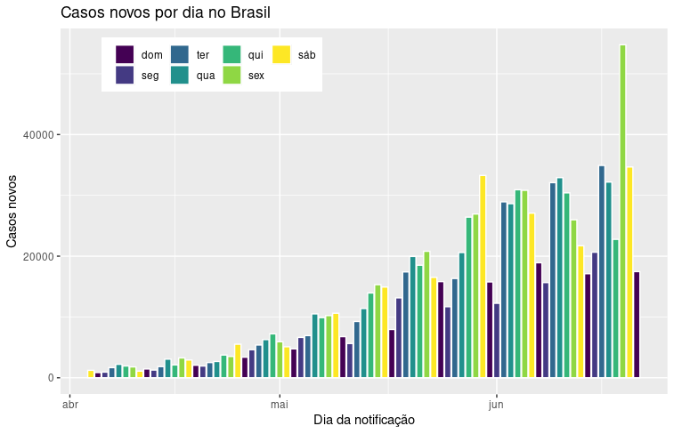
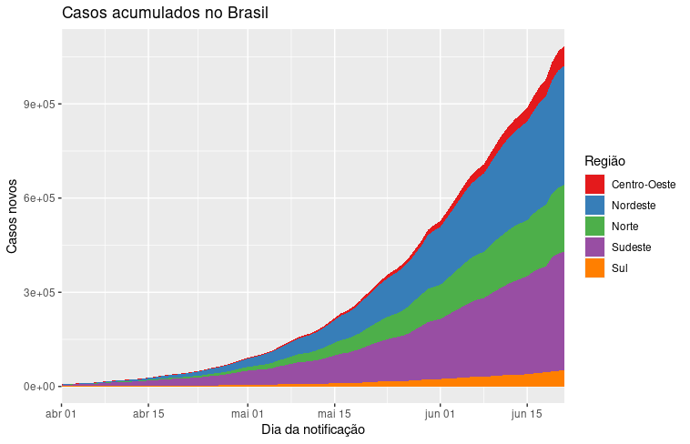
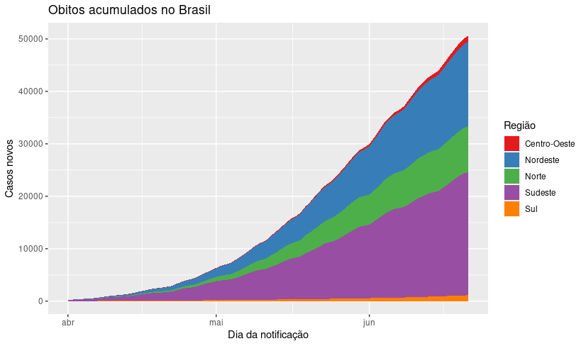
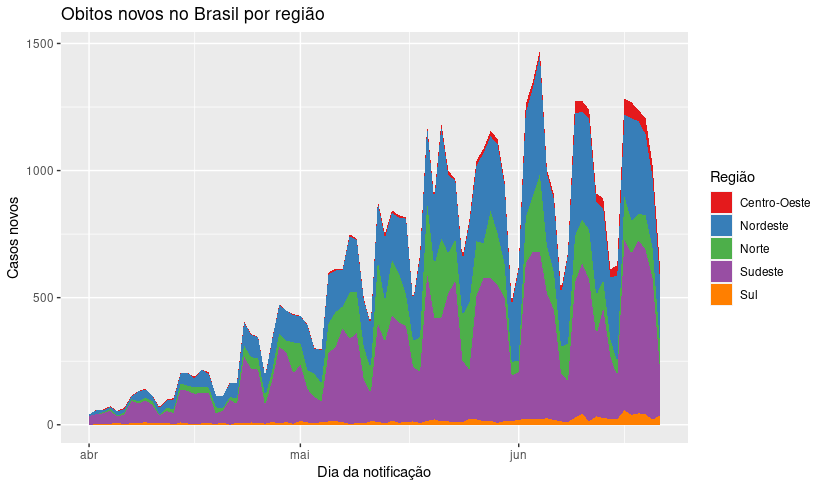

# Descrição do cenario 
  A doença do coronavírus (COVID-19) é uma doença infecciosa causada 
  por um coronavírus recém-descorberto
  A maioria das pessoas que adoece em decorrência da COVID-19
  apresentará sintomas leves a moderados e se recuperará sem
  tratamento especial.
  Até o momento, 60.632 pessoas morreram em decorrência da pandemia do
  novo coronavírus,Até o momento, 60.632 pessoas morreram em 
  decorrência da pandemia do novo coronavírus
  Contudo, na avaliação do Ministério da Saúde, o país atingiu um
  platô, quando a curva do número de mortes entra em um momento de
  estabilização. Nas últimas semanas, o total de novos óbitos vêm
  oscilando.

## Material base para análise 

    Link do arquivo .csv para download:

- [covid-br-ms-states.csv](https://raw.githubusercontent.com/marcuswac/covid-br-data/master/covid-br-ms-states.csv)


## Brasil

### Casos novos por dia Brasil

```{r, echo=FALSE}

```

### Casos acumulados no Brasil por região

```{r, echo=FALSE}

```

###  Óbitos acumulados no Brasil

```{r, echo=FALSE}

```

### Óbitos novos por região

```{r, echo=FALSE}

```

## Codigo usado para análise

[Github](https://github.com/DaviCorreia/DataScienceCasosdoCOVID-19)